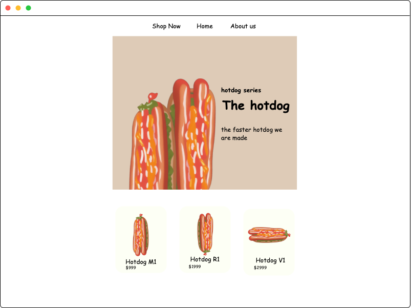

# All together
## requirement

### Frontend

- Svelte
- SvelteKit
- TypeScript
- Mock Service Worker
- Aslant + Prettier
- Vitest + Playwright

#### Progress

Layout design:


### Backend

- Actix (Rust)
- Diesel (PG)

#### Progress

Make an server can handle request and respose
Provide a virtual product with a special structure
```rust
// just make two value different
{
  "product_name": "&'static str"
  "product_id": "u32"
  "counter": "i32"
} 
```

Not Regular API Standard
- GET /product
- GET /buy/1


### Infrastructure

- k8s
- istio

## Reference
- Frontend
  - [offical svelte website](https://svelte.dev/docs)
  - [svelte loop - each block](https://svelte.dev/tutorial/each-blocks)
  - [basic svelte](https://svelte.dev/tutorial/basics)
  - [page option](https://kit.svelte.dev/docs/page-options)
  - [dynamic import - RELP svelte](https://svelte.dev/repl/16b375da9b39417dae837b5006799cb4?version=3.25.0)
  - [svelte image grid](https://svelte.dev/repl/7b791af77bde47a082781bf9197a0d32?version=3.38.3)
  - [understand playwright](https://github.com/microsoft/playwright)
  - [single import](https://svelte.dev/repl/53ab00ed8a6e4fcfa257f8b76f1b6851?version=3.38.2)
  - [use local static assets](https://stackoverflow.com/questions/56895865/how-to-use-local-static-images-in-svelte/57019312#57019312)
  - [fs on svelte](https://stackoverflow.com/questions/72044970/how-to-work-with-files-using-svelte-when-fs-doesnt-work)
  - [another dynamic importing](https://rodneylab.com/sveltekit-dynamic-image-import/)
  - [image import issues from github](https://github.com/sveltejs/svelte/issues/4830)
- Backend
  - [Offical rust tutorial](https://actix.rs/docs/getting-started/)
  - [docs.rs actix-web](https://docs.rs/actix-web/latest/actix_web/)
  - [crates.io actix-web](https://crates.io/crates/actix-web)
  - [variable str on rust](https://users.rust-lang.org/t/quick-question-static-str/35940)
  - [static str on rust](https://course.rs/advance/lifetime/static.html)
  - [struct Mutex](https://doc.rust-lang.org/std/sync/struct.Mutex.html)
- Infra
  - [yaml enginnering example](https://codefresh.io/learn/software-deployment/kubernetes-deployment-yaml/)
  - [k8s tutorial](https://kubernetes.io/docs/tutorials/)
  - [posgresql with k8s](https://www.containiq.com/post/deploy-postgres-on-kubernetes)
  - [intro of k8s](https://cwhu.medium.com/kubernetes-basic-concept-tutorial-e033e3504ec0)
  - [k8s driver - docker](https://minikube.sigs.k8s.io/docs/drivers/docker/)
  - [minikube](https://kubernetes.io/docs/tutorials/hello-minikube/)
  - [padding external ip](https://stackoverflow.com/questions/44110876/kubernetes-service-external-ip-pending)
  - [kompose](https://kubernetes.io/zh-cn/docs/tasks/configure-pod-container/translate-compose-kubernetes/)
  - [Rust Docker tutorial](https://tutorialedge.net/rust/rust-docker-tutorial/)
  - [deployment the rust from offical image](https://www.docker.com/blog/simplify-your-deployments-using-the-rust-official-image/)
  - [Rust image on dockerhub](https://hub.docker.com/_/rust/tags?page=2)
  - [rust-web-starter](https://github.com/ghotiphud/rust-web-starter/blob/master/api_server/Dockerfile)